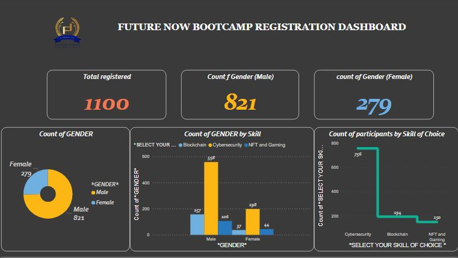

# Data-Analysis-Portfolio

## Table of Content
- [Data Analysis](#data-analysis)
- [Data Source](#data-source)


## Data Source
- Ms Excel for Data Cleaning [Download here](https://microsoft.com)
- SQL Server for Querying and Analysis
- Power BI for Reporting


### Data Analysis
```SQL
SELECT * Table1
WHERE cond = 2
```

``` M LANG
Table.RemoveColumns(#"Changed Type",{"Column1"})
```
| Heading 1|Heading 2|
|----------|---------|
|Column 1| Column 2|

😃

💻

`Column 1`

`Table 1 = Tabl 2+Table 3`


